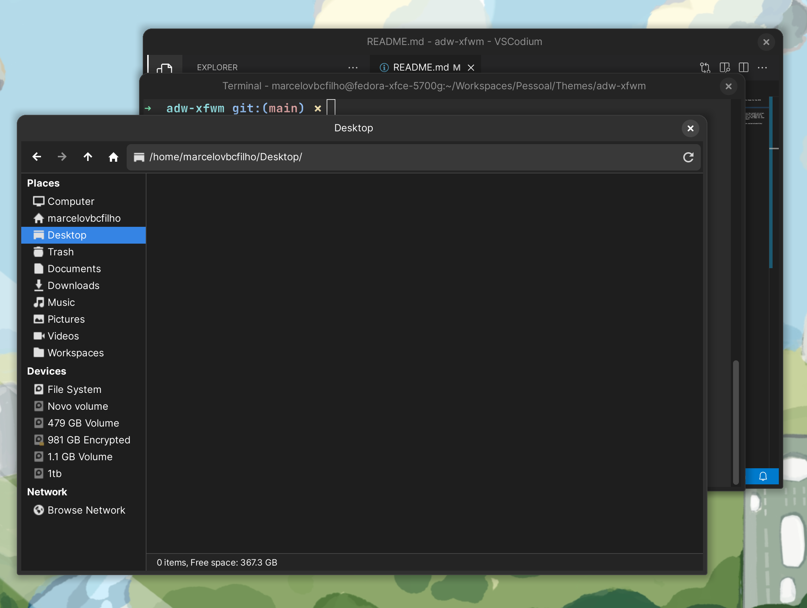

# Adw XFWM

Adw XFWM is a libadwaita theme for the XFCE window manager.

# Gallery



# Installation

Clone the project and run the install.sh script. After installing just select the appropriate theme for your resolution, for example for 4k monitor with 2x scalling use the xhdpi for other resolutions use the default.

```bash
git clone https://github.com/marcelovbcfilho/adw-xfwm.git
cd ./adw-xfwm
./install.sh
```

# Disclaimer

This theme is based on the default libadwaita theme. So basically I opened a libadwaita app like Gnome software and copied it's look.

